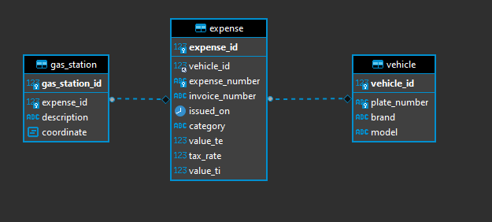

# EXERCICE D'EVALUATION TECHNIQUE

_Avant d’envisager une rencontre dans nos locaux, nous vous remercions de bien vouloir réaliser cet exercice. Nous nous engageons à vous faire un retour sur votre prestation, et ce, même si nous n’étions pas amenés à nous rencontrer._

L’entreprise **TechLoad** souhaite faciliter l'intégration de fichiers de dépenses pour des véhicules dans une base de données. Ces fichiers sont transmis par le fournisseur **InfinityEnergy**. 
Ces fichiers contiennent les prises de carburant sur des périodes.

Le fichier du fournisseur est définit sous le format suivant :

* Fichier CSV avec pour séparateur “;” 
* Encodage UTF-8 (sans BOM) 
* Nombre max de ligne par fichier : 1 000 000 
* Flux mensuel 

L'objectif du test technique est de mettre en place le système d'intégration de ce flux.
Votre application devra alors pouvoir importer un fichier, et insérer les données. 
**TechLoad** souhaite avoir des moyens pour savoir si l'intégration des données s'est correctement déroulée. À vous de mettre en place vos propres jeux de données et contrôles.

Afin d'exploiter ces données intégrées, l’entreprise **TechLoad** s’attend à la mise en place d’un tableau de bord lui permettant d’analyser les indicateurs suivants (note: _vous êtes libre de choisir ce que vous voulez pour concevoir ce tableau de bord_) :

* La somme totale des dépenses  
* La somme des dépenses par catégorie de dépense  
* Le TOP 10 des véhicules qui dépensent le plus avec la somme des dépenses 

Ces deux indicateurs doivent posséder un filtre sur une période bornant les résultats et un filtre sur l’affichage en TTC ou HT.

* (_Facultatif_) Une liste des dernières 50 dépenses pour une immatriculation 

Afin de simplifier l’intégration de votre réalisation dans leur SI, cette base technique vous est imposée (docker-compose + Symfony et la structure de la base).

Avant toute intégration dans leur SI, un contrôle du code sera effectué pour vérifier les points suivants :

* Qualité 
* Lisibilité et organisation du code source 
* Choix de conception 
* Soin apporté aux détails et à la validation des données 
* Réponse au problème posé 
* Documentation 

Cette mission ne devrait pas vous prendre trop de temps, quelques heures tout au plus!

Merci de déposer votre code sur github et nous donner l’url en faisant «répondre à tous» au mail qui vous a été envoyé.

Bon code ! 

# SCHEMA BASE DE DONNEE

Le MCD de la base de données est le suivant :



Pour simplifier le test, le schéma est déjà présent dans le fichier .docker/mysql/docker-entrypoint-initdb.d/database.sql. et il est initialisé par docker-compose au démmarage.

|vehicle|Contient les informations d'un véhicule|Unique sur l'immatriculation|
|expense|Contient les dépenses carburants|Unique sur le numéro de dépense|
|gas_station|Contient les informations géographique d'une prise de carburant|Unique sur le numéro de dépense|

# DETAILS FICHIER D'IMPORT

Le format détaillé du fichier d'import est le suivant :

| Colonne        |    Nom                   | Format                | Exemple                 | Mapping BDD            |
| :------------- | :----------------------: | :-------------------: | :---------------------: | :--------------------: |
| A              | Immatriculation          | Format FR depuis 2009 | AA-666-BB               | vehicle (plate_number) |
| B              | Marque                   | Libre                 | Peugeot                 | vehicle (brand) |
| C              | Model                    | Libre                 | 208                     | vehicle (model) |
| D              | Catégorie  de dépense    | Enum : gasoline,diesel,electricity_charge,gpl,hydrogen |  gasoline  | expense (category) |
| E              | Libellé                  | Libre                 | Prise de carburant      | expense (description) |
| F              | HT                       | Decimal(10,3) FR      | 10,516                  | expense (value_te) |
| G              | TTC                      | Decimal(10,3) FR      | 10,516                  | expense (value_ti) |
| H              | TVA                      | Decimal(5,3) FR       | 20,000                  | expense (tax_rate) |
| I              | Date & heure             | Format datetime FR    | 01/12/2018 10:59:59     | expense (issued_on) |
| J              | Numéro facture           | Libre (unique)        | FAC000000000001         | expense (invoice_number) |
| K              | Code dépense             | Libre (unique)        | DEP000000000001         | expense (expense_number) |
| L              | Station                  | Libre                 | INFINITY ACCESS, Chemin d'Innovation, 04 06 04 06 04 | gas_station (description) |
| M              | Position GPS (Latitude)  | Coordonnée GPS        | 40.71727401             | gas_station (coordinate) |
| N              | Position GPS (Longitude) | Coordonnée GPS        | -74.00898606            | gas_station (coordinate) |


# DEMARAGE DU PROJET

**Recommandations pour l'environnement de travail**
- unzip ou git
- [docker](https://docs.docker.com/engine/install/) (^20.10)
- [docker-compose](https://docs.docker.com/compose/install/) (^1.29)
- Un IDE adapté pour éditer les sources PHP (phpstorm, Netbeans, VisualStudio, au libre choix du développeur)
  
**Récupérer le code source**
```console
foobar@dev-desktop ~ $ git clone https://gitlab.gac-technology.com/gac/gac_test.git
```

**Mettre en place l'environnement de travail**
```console
foobar@dev-desktop ~ $ cd gac_test 
foobar@dev-desktop ~/gac_test $ docker-compose up -d --build
Creating network "gac_test_default" with the default driver
Building php
Step 1/6 : FROM php:7.4.11-fpm-alpine
 ---> 195416cf0598
Step 2/6 : WORKDIR /application
 ---> Using cache
 ---> bf4403e842df
Step 3/6 : RUN apk add --no-cache --virtual         .phpize-deps $PHPIZE_DEPS         autoconf         pkgconf         libssl1.1         openssl-dev         freetype-dev         libpng-dev         libjpeg-turbo-dev         libmcrypt-dev         git         openssh-client         curl         wget         libtool         zlib-dev         icu-dev         g++         linux-headers     && pecl bundle -d /usr/src/php/ext redis     && docker-php-ext-install -j2 redis     && docker-php-ext-configure intl     && docker-php-ext-install -j2 intl     && pecl bundle -d /usr/src/php/ext mcrypt     && docker-php-ext-configure mcrypt     && pecl bundle -d /usr/src/php/ext apcu     && docker-php-ext-install -j2 apcu     && docker-php-ext-configure gd     && docker-php-ext-install -j2 bcmath gd iconv mcrypt     && docker-php-ext-enable opcache     && rm /usr/src/php/ext/*.tgz     && pecl install xdebug     && docker-php-ext-enable xdebug     && echo "error_reporting = E_ALL" >> /usr/local/etc/php/conf.d/docker-php-ext-xdebug.ini     && echo "display_startup_errors = On" >> /usr/local/etc/php/conf.d/docker-php-ext-xdebug.ini     && echo "display_errors = On" >> /usr/local/etc/php/conf.d/docker-php-ext-xdebug.ini     && echo "xdebug.profiler_enable = 0" >> /usr/local/etc/php/conf.d/docker-php-ext-xdebug.ini     && echo "xdebug.remote_connect_back=off" >> /usr/local/etc/php/conf.d/docker-php-ext-xdebug.ini     && echo "xdebug.remote_host=host.docker.internal" >> /usr/local/etc/php/conf.d/docker-php-ext-xdebug.ini     && echo "xdebug.remote_port=10000" >> /usr/local/etc/php/conf.d/docker-php-ext-xdebug.ini     && echo "xdebug.remote_autostart=0" >> /usr/local/etc/php/conf.d/docker-php-ext-xdebug.ini     && echo "xdebug.idekey=PHPSTORM" >> /usr/local/etc/php/conf.d/docker-php-ext-xdebug.ini     && echo "xdebug.max_nesting_level=256" >> /usr/local/etc/php/conf.d/docker-php-ext-xdebug.ini     && echo "xdebug.remote_enable=1" >> /usr/local/etc/php/conf.d/docker-php-ext-xdebug.ini     && php -r "copy('https://getcomposer.org/installer', 'composer-setup.php');"     && php composer-setup.php --filename=composer --install-dir=/usr/bin     && chmod +x /usr/bin/composer     && php -r "unlink('composer-setup.php');"     && composer --version     && pecl channel-update pecl.php.net     && composer global require "phpunit/phpunit"     && export PATH=$PATH:/root/.composer/vendor/bin     && ln -s /root/.composer/vendor/bin/phpunit /usr/bin/phpunit
 ---> Using cache
 ---> e83ab92f5586
Step 4/6 : RUN composer self-update
 ---> Using cache
 ---> 62fef6222a65
Step 5/6 : RUN wget https://get.symfony.com/cli/installer -O - | bash
 ---> Using cache
 ---> fa9c750091a5
Step 6/6 : RUN mv /root/.symfony/bin/symfony /usr/local/bin/symfony
 ---> Using cache
 ---> cdbe2c7ded84

Successfully built cdbe2c7ded84
Successfully tagged gac_test_php:latest
Creating adminer ... done
Creating db      ... done
Creating php     ... done
```

**Vérification que tout fonctionne**
```console
foobar@dev-desktop ~/gac_test $ docker-compose ps

 Name                Command                  State                              Ports                        
--------------------------------------------------------------------------------------------------------------
adminer   entrypoint.sh docker-php-e ...   Up             0.0.0.0:9081->8080/tcp,:::9081->8080/tcp            
db        docker-entrypoint.sh --sec ...   Up (healthy)   3306/tcp, 33060/tcp                                 
php       docker-php-entrypoint sh - ...   Up             0.0.0.0:88->80/tcp,:::88->80/tcp, 8080/tcp, 9000/tcp
```

**Accéder à l'application :**
[http://localhost:88/](http://localhost:88/)
